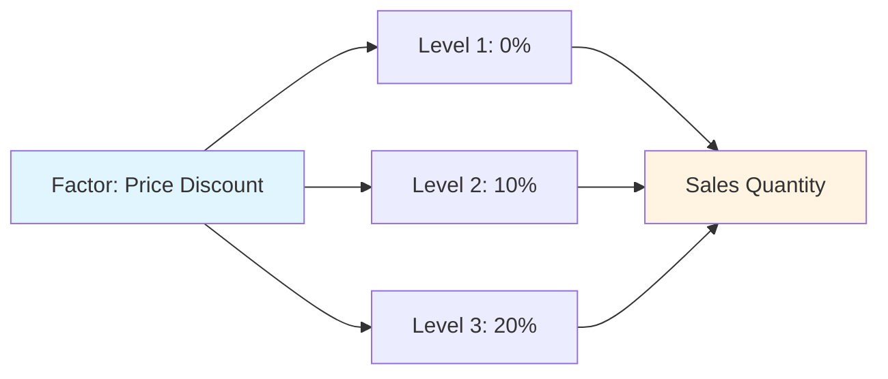
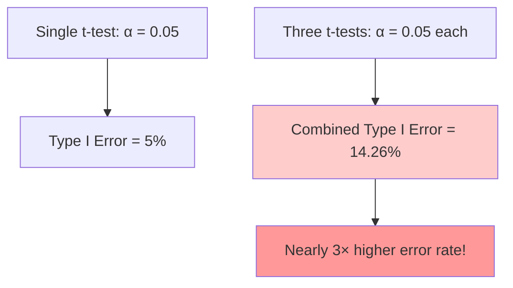
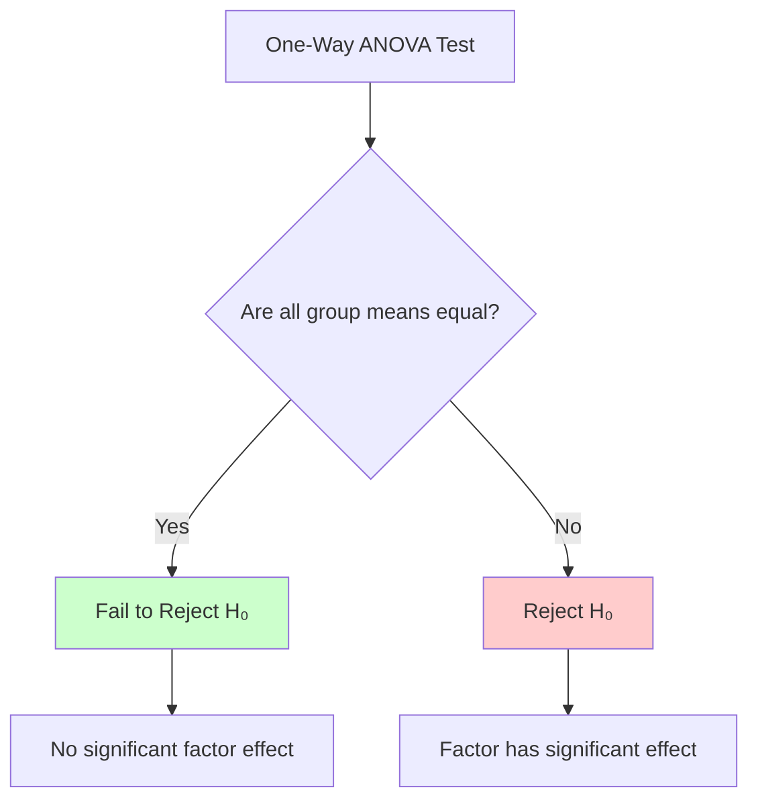
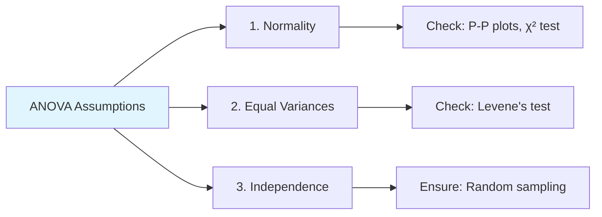
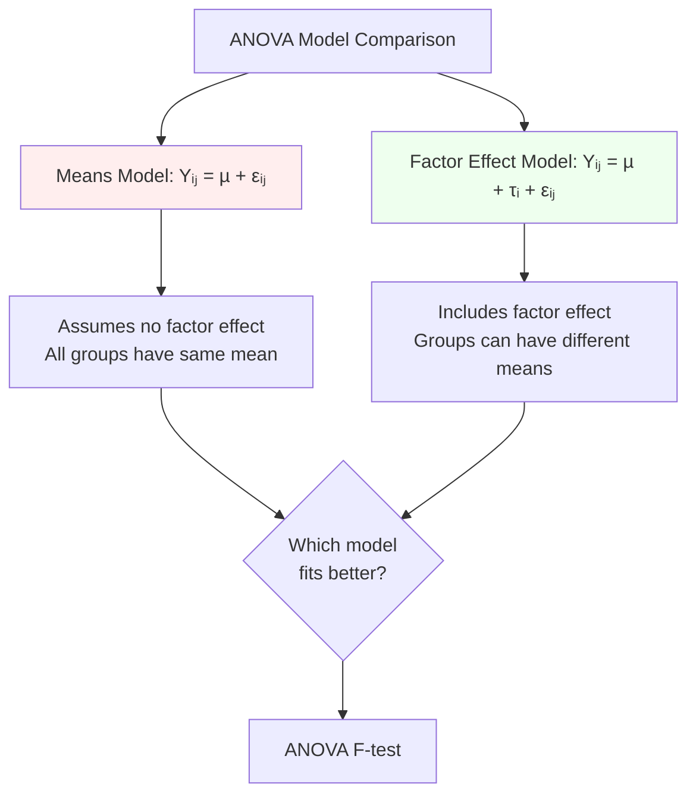
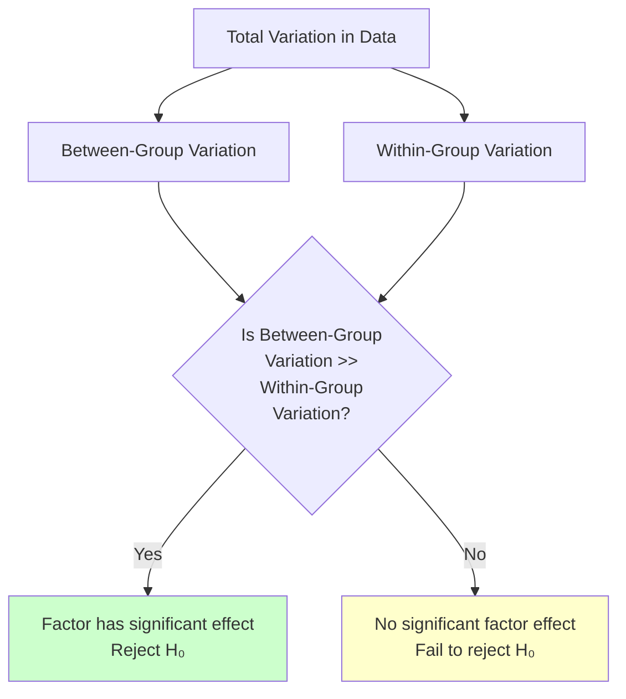
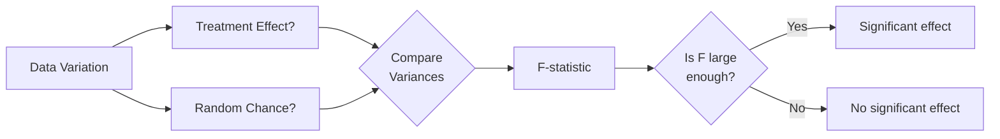
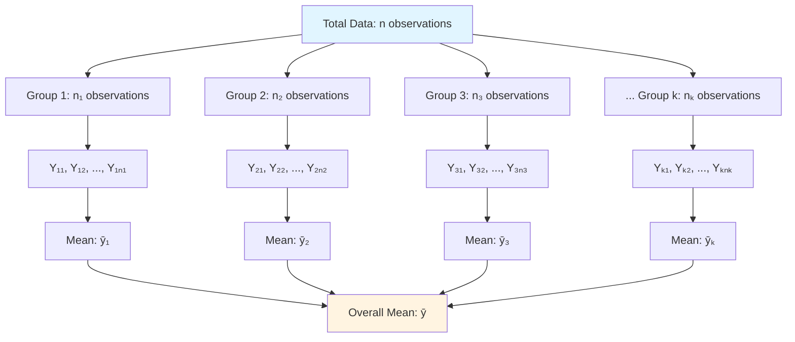
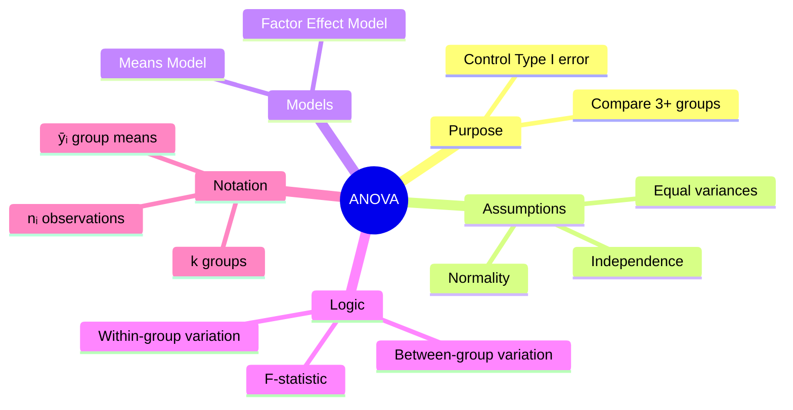

# Analysis of Variance (ANOVA) - Complete Study Notes

## Table of Contents
1. [Introduction to ANOVA](#introduction-to-anova)
2. [The Problem with Multiple t-Tests](#the-problem-with-multiple-t-tests)
3. [One-Way ANOVA](#one-way-anova)
4. [ANOVA Models](#anova-models)
5. [The Logic of ANOVA: Partitioning Variation](#the-logic-of-anova-partitioning-variation)
6. [ANOVA Notation](#anova-notation)

---

## Introduction to ANOVA

### What is ANOVA?

**Analysis of Variance (ANOVA)** is a statistical method used to simultaneously check whether population means from more than two populations (or groups) are different. It is not a mathematical theorem but rather a convenient method of arranging arithmetic to compare population means.

### Core Problem

Standard two-sample t-tests are **unsuitable for comparing more than two groups** because they inflate the Type I error (the probability of falsely rejecting a true null hypothesis).

### Motivating Example

A retail store wants to study the impact of different price discounts on the average sales quantity of a product.

- **Factor/Treatment:** The variable being manipulated or studied
  - Example: Price Discount
- **Levels:** The different values or categories of the factor
  - Example: 0%, 10%, 20%
- **Response/Outcome Variable:** The variable being measured
  - Example: Sales Quantity

### Experimental Design

Different levels of the factor are assigned randomly to different units (e.g., randomly chosen days). This is a **single-factor experimental design**. 



**Note:** Observational studies, where the researcher does not control the factor levels, are also common.

---

## The Problem with Multiple t-Tests

### Why Multiple t-Tests Fail

When comparing more than two groups, using multiple two-sample t-tests is **inappropriate** because the overall Type I error (false positive) rate increases significantly.

### Example: Three Groups

Consider comparing three groups (A, B, C) - for instance, sales at 0%, 10%, and 20% discount levels.

#### Table 7.1: Three Different Two-Sample t-Tests

| Test | Null Hypothesis (H₀) | Alternative Hypothesis (H₁) |
|------|---------------------|----------------------------|
| Test A | µ₀% = µ₁₀% | µ₀% ≠ µ₁₀% |
| Test B | µ₀% = µ₂₀% | µ₀% ≠ µ₂₀% |
| Test C | µ₁₀% = µ₂₀% | µ₁₀% ≠ µ₂₀% |

Each test has a significance level of α = 0.05.

### Error Inflation Problem

Let's calculate the overall Type I error:

- **P(A)** = Probability of correctly retaining H₀ for Test A = 1 - α = 0.95
- **P(B)** = Probability of correctly retaining H₀ for Test B = 1 - α = 0.95
- **P(C)** = Probability of correctly retaining H₀ for Test C = 1 - α = 0.95

The probability of correctly retaining H₀ for **all three** tests simultaneously:

**P(A ∩ B ∩ C) = 0.95 × 0.95 × 0.95 = 0.8573**

Therefore, the overall Type I error for this set of tests is:

**1 - 0.8573 = 0.1426 (14.26%)**

This is **much higher** than the intended α = 0.05 (5%)!



### General Formula

For **n** simultaneous comparisons, the overall Type I error is approximately:

**1 - (1 - α)ⁿ**

### Conclusion

ANOVA is used to compare three or more groups **simultaneously** while controlling the Type I error at the desired significance level.

---

## One-Way ANOVA

### Purpose

To study the impact of a **single factor** (with k levels) on a continuous response variable.

### Hypotheses

- **Null Hypothesis (H₀):** µ₁ = µ₂ = ... = µₖ
  - All group population means are equal
  - Equivalent to stating that all factor effects (τᵢ) are zero
  
- **Alternative Hypothesis (H₁):** Not all µ values are equal
  - At least one group mean is different



### Key Assumptions

1. **Normality:** In each group, the response variable follows a normal distribution
2. **Homogeneity of Variance:** The population variances for all groups are equal
3. **Independence:** Samples are drawn randomly and independently

### Assumption Checking

ANOVA is **robust** to minor violations of the first two assumptions, but they should be checked as a best practice:

- **Normality:** Use P-P plots or chi-square goodness-of-fit tests
- **Equal Variances:** Use hypothesis tests for equal variances (e.g., Levene's test)



---

## ANOVA Models

ANOVA compares two statistical models to see which better explains the data.

### 1. Means Model (Reduced Model)

**Equation:** Yᵢⱼ = µ + εᵢⱼ

**Description:**
- Assumes a **single overall mean (µ)** for all observations, regardless of factor level
- The error term (εᵢⱼ) is normally distributed with mean 0 and standard deviation σ
- This model does **not** include the effect of the factor
- Represents the null hypothesis scenario

### 2. Factor Effect Model (Full Model)

**Equation:** Yᵢⱼ = µ + τᵢ + εᵢⱼ

**Description:**
- Accounts for the overall mean (µ) and the **specific effect of the i-th factor level (τᵢ)**
- The factor effect τᵢ is the deviation of the group mean from the overall mean
- A non-zero τᵢ implies the factor influences the outcome variable
- The Means Model is a **special case** of this model where all τᵢ = 0



### Model Components

| Component | Symbol | Description |
|-----------|--------|-------------|
| Observation | Yᵢⱼ | The j-th observation in the i-th group |
| Overall Mean | µ | Grand mean across all observations |
| Factor Effect | τᵢ | Effect of the i-th factor level (deviation from µ) |
| Error Term | εᵢⱼ | Random error, normally distributed N(0, σ²) |

---

## The Logic of ANOVA: Partitioning Variation

### Core Idea

The fundamental concept of ANOVA is to determine if the **variation between group means** is significantly larger than the **variation within the groups**.

### Visual Concept



### Conceptual Understanding (Figure 7.2)

#### Scenario 1: H₀ is True (No Factor Effect)

If the factor levels have **no impact**, the group means (µ₁, µ₂, µₖ) will be close to each other:

```
Group 1:  • • • • • •
Group 2:   • • • • • •
Group 3:  • • • • • •
          ↓
    All clustered around
    a common mean (µ)
```

- Data points for all groups cluster around a common center
- Between-group variation ≈ Within-group variation

#### Scenario 2: H₁ is True (Factor Has Effect)

If the factor levels have a **significant impact**, the group means will be different:

```
Group 1:  • • • •              (µ₁)
Group 2:              • • • •  (µ₂)
Group 3:                     • • • • (µ₃)
          ↓
    Groups separated with
    distinct means
```

- Group means are separated from one another
- Between-group variation >> Within-group variation

### Objective

To verify whether the **variation due to the treatment (factor)** is statistically greater than the **variation due to random chance**.



---

## ANOVA Notation

### Standard Notation for One-Way ANOVA

The following notation is used for calculations in a one-way ANOVA with a single factor at k levels:

| Symbol | Description |
|--------|-------------|
| **k** | Number of groups (or factor levels) |
| **nᵢ** | Number of observations in group i (i = 1, 2, ..., k) |
| **n** | Total number of observations: n = Σnᵢ (sum from i=1 to k) |
| **Yᵢⱼ** | The j-th observation in the i-th group |
| **ȳᵢ** (or µᵢ) | Sample mean of group i: ȳᵢ = (1/nᵢ) × Σ Yᵢⱼ (for j=1 to nᵢ) |
| **ȳ** (or µ) | Overall sample mean: ȳ = (1/n) × ΣΣ Yᵢⱼ (for all i and j) |

### Data Structure



### Example Structure

Suppose we have **k = 3** groups with the following sample sizes:

| Group | Factor Level | Sample Size (nᵢ) | Observations |
|-------|-------------|-----------------|--------------|
| 1 | 0% discount | n₁ = 5 | Y₁₁, Y₁₂, Y₁₃, Y₁₄, Y₁₅ |
| 2 | 10% discount | n₂ = 5 | Y₂₁, Y₂₂, Y₂₃, Y₂₄, Y₂₅ |
| 3 | 20% discount | n₃ = 5 | Y₃₁, Y₃₂, Y₃₃, Y₃₄, Y₃₅ |

**Total observations:** n = n₁ + n₂ + n₃ = 5 + 5 + 5 = 15

---

## Summary

### Key Takeaways

1. **ANOVA vs. Multiple t-tests:** ANOVA controls the overall Type I error when comparing three or more groups, unlike multiple t-tests which inflate the error rate.

2. **One-Way ANOVA:** Used to test if a single factor with multiple levels has a significant effect on a continuous response variable.

3. **Assumptions Matter:** Normality, equal variances, and independence should be checked, though ANOVA is robust to minor violations.

4. **Two Models:** ANOVA compares a simple means model (no factor effect) against a factor effect model to determine if the factor significantly influences the outcome.

5. **Variation Partitioning:** The core logic involves comparing between-group variation to within-group variation. A large ratio suggests the factor has a significant effect.

6. **Notation is Important:** Understanding the notation (k, nᵢ, Yᵢⱼ, ȳᵢ, ȳ) is essential for conducting and interpreting ANOVA calculations.



---

## Additional Notes

- ANOVA provides an **omnibus test** - it tells you if *at least one* group differs, but not *which* groups differ.
- **Post-hoc tests** (like Tukey's HSD) are needed after a significant ANOVA to identify specific group differences.
- ANOVA can be extended to **multiple factors** (Two-Way ANOVA, etc.) and **repeated measures** designs.
- The F-statistic in ANOVA follows an F-distribution under the null hypothesis.

---

*These notes provide a comprehensive foundation for understanding Analysis of Variance (ANOVA). Review the diagrams and examples carefully, and ensure you understand the logic behind comparing variations rather than just means.*